# Group-Evals — Student Evaluation, Quiz & Shop-Inventory Platform

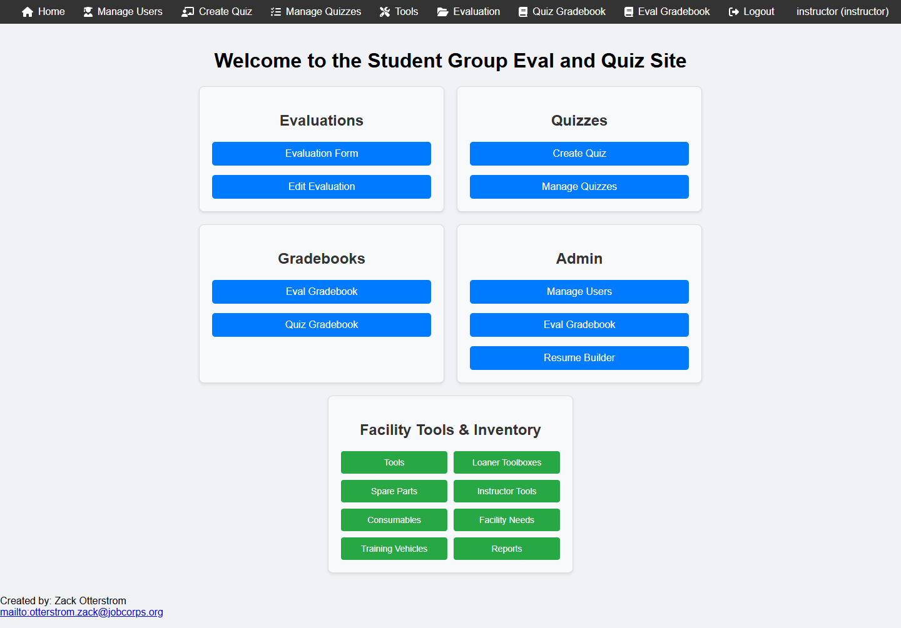

## Purpose

Group-Evals is a full-stack web application I built for an automotive technical
training program where one instructor manages a rotating cohort of students,
runs quizzes and group evaluations, and is also responsible for the physical
shop — tools, consumables, training vehicles, spare parts, and facility
repairs. Off-the-shelf LMS products covered the academic side or the inventory
side, but never both, and never the way the program actually operates. The app
collapses both responsibilities into a single role-aware tool so the
instructor can spend less time juggling spreadsheets and more time teaching.

The product targets two distinct users:

- **Instructors** — author quizzes and rubrics, build cohorts and courses,
  grade group evaluations, and operate the full shop inventory (tools, spare
  parts, consumables, loaner toolboxes, training vehicles, facility tickets,
  and PDF reports).
- **Students** — see only their own dashboard, take published quizzes,
  submit peer-evaluations, and review their grades and missed questions.

## How it is used

After authenticating, the navbar and home page reshape themselves to the
user's role. An instructor lands on a dashboard with five action cards
(Evaluations, Quizzes, Gradebooks, Admin, and Facility Tools & Inventory),
while a student sees only the cards relevant to them and an in-progress
summary at the top of the page.

| | |
|---|---|
|  | 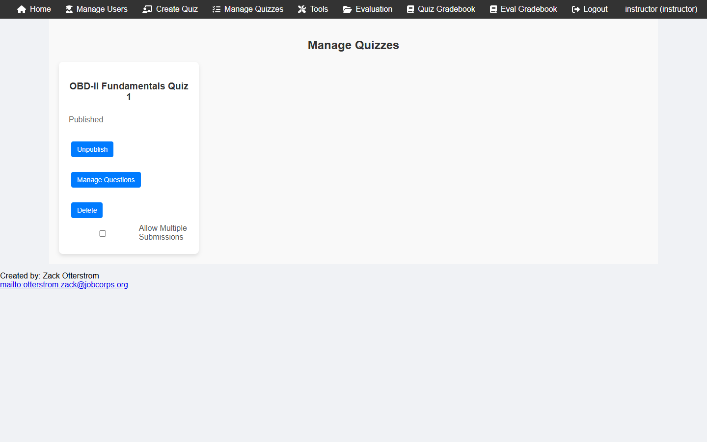 |
| **Instructor home** — role-aware dashboard. | **Quizzes** — author and publish per cohort/course. |
| 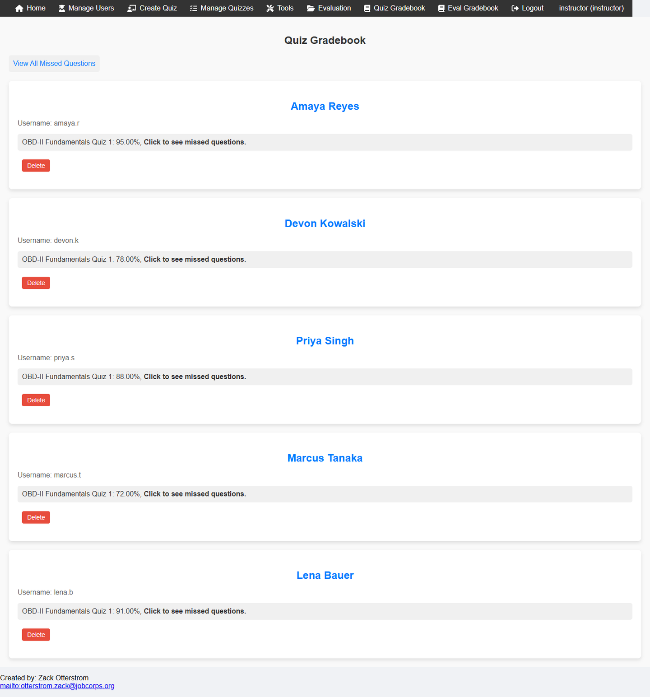 | 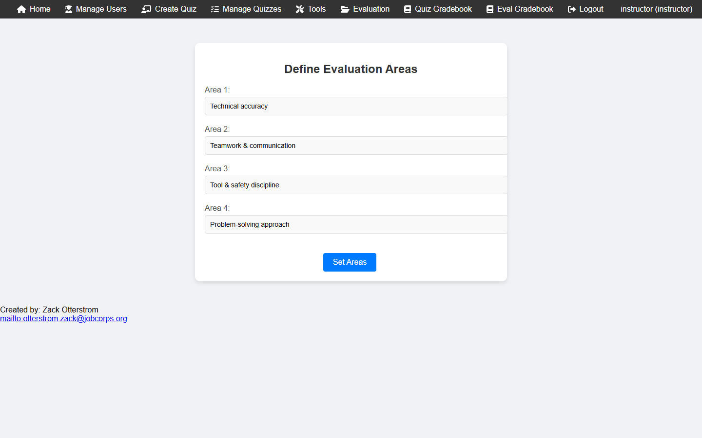 |
| **Quiz gradebook** — every submission, percentage, and the missed-questions drill-down. | **Evaluation rubric** — four customizable criteria used for peer-evaluations. |
| 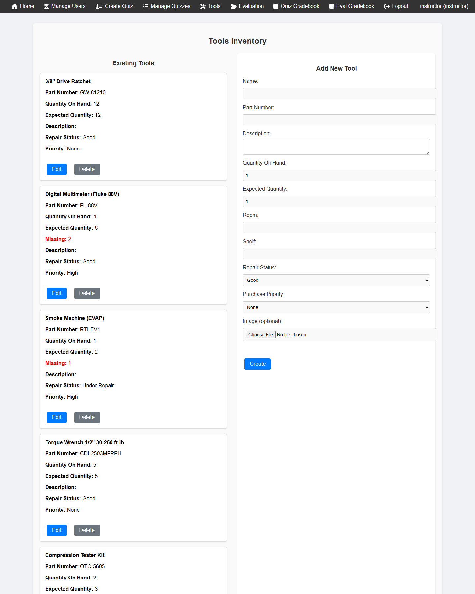 | 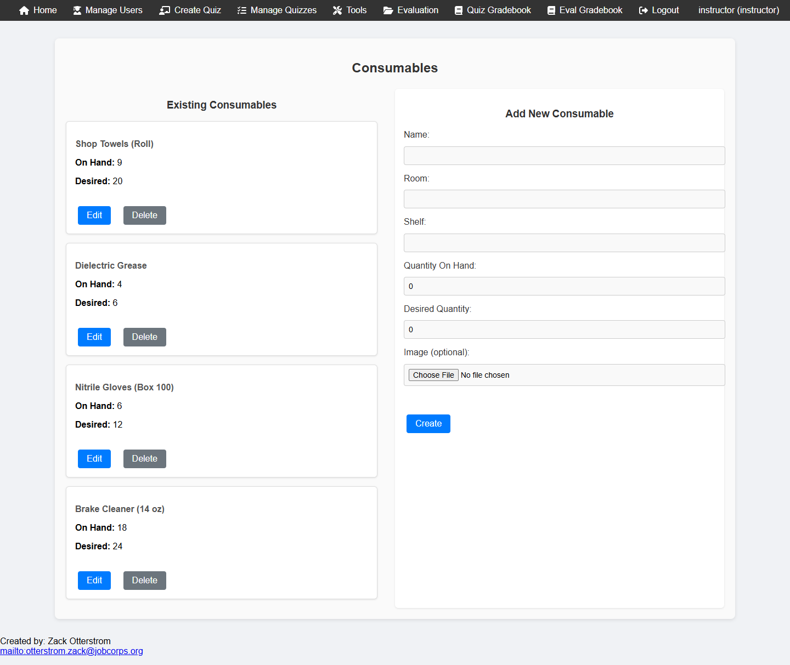 |
| **Tools** — on-hand vs. expected counts, repair status, purchase priority. | **Consumables** — desired stock targets with a re-order signal. |
| 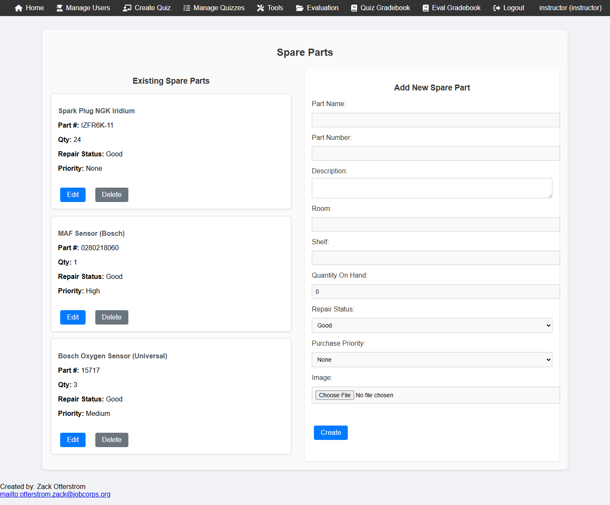 | 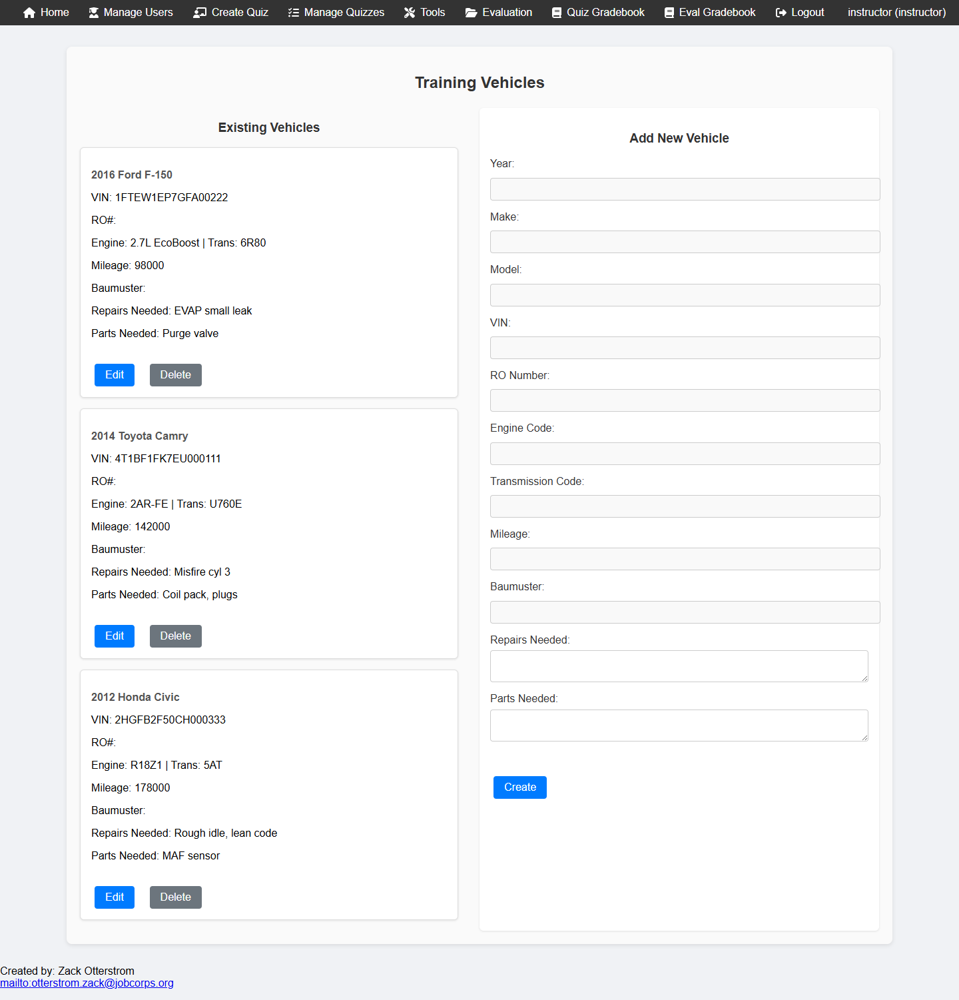 |
| **Spare parts** — part numbers, location, repair flag, priority. | **Training vehicles** — VIN-tracked fleet with repairs and parts needed. |
| 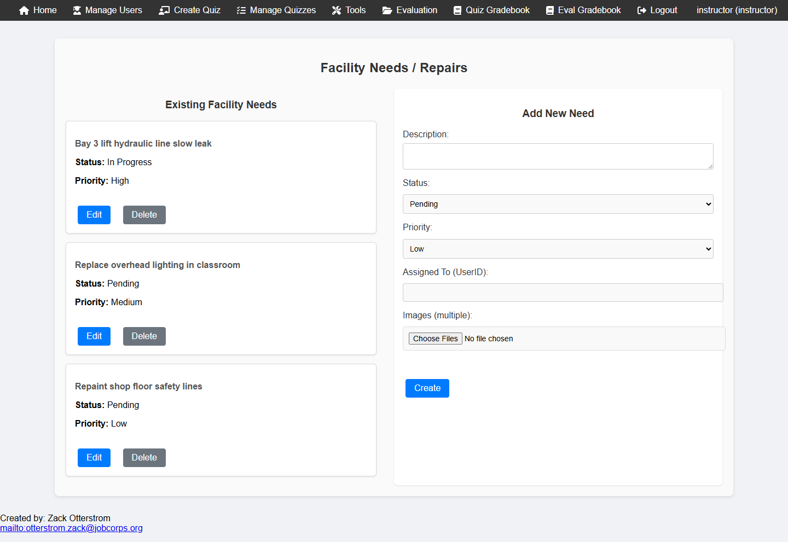 | 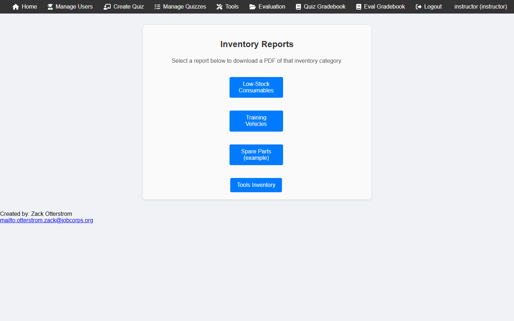 |
| **Facility needs** — work tickets with status and priority. | **Reports** — server-rendered PDF exports of any inventory category. |
| 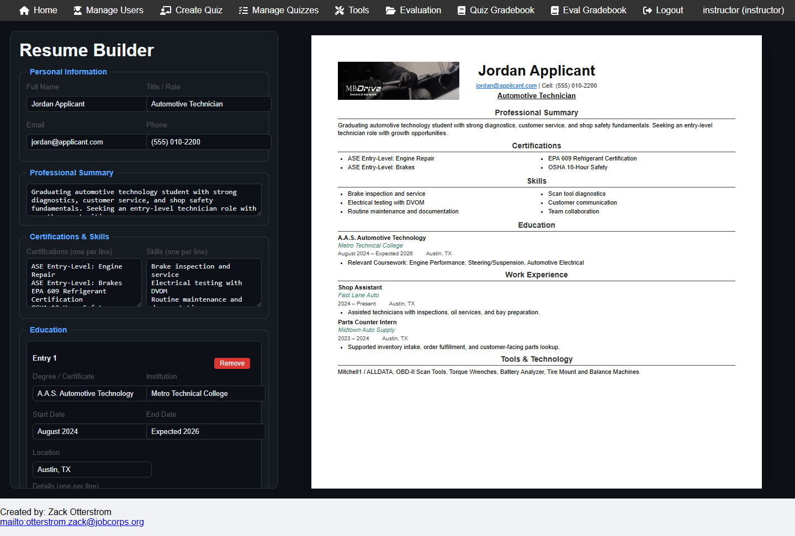 | 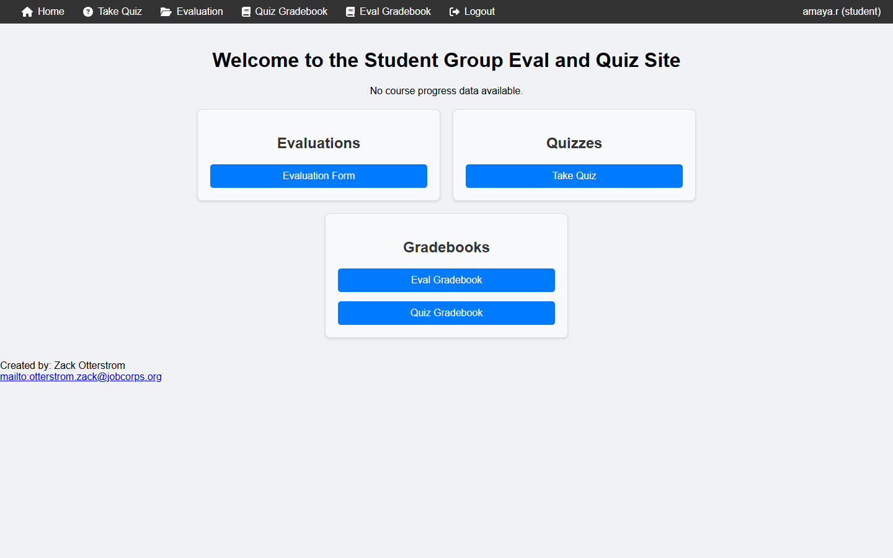 |
| **Resume builder** — instructor utility for graduating students. | **Student home** — slimmed-down view, only the student's own actions. |
| 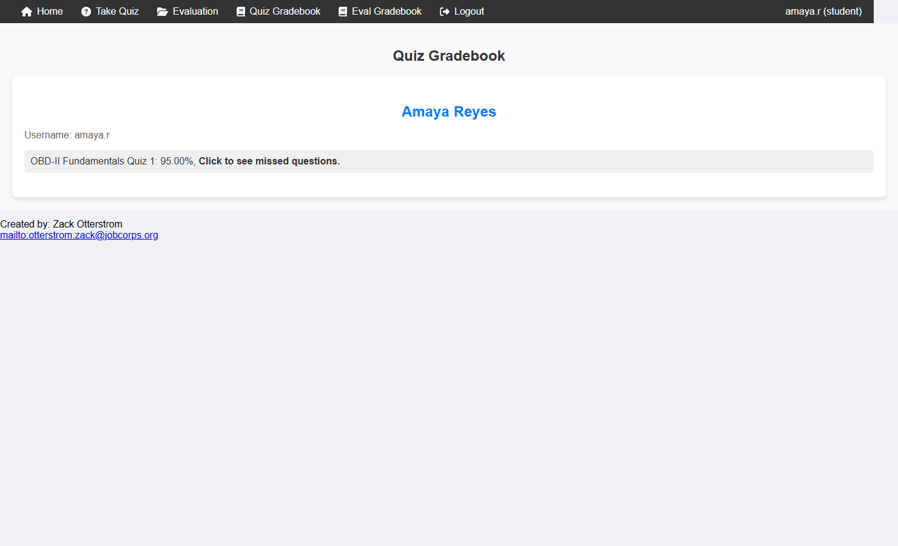 | |
| **Student gradebook** — a student sees only their own scores. | |

## Technology

| Layer | Stack |
|---|---|
| Frontend | **React 18** (CRA), **React Router 6**, **React-Bootstrap**, **Axios**, **DOMPurify** for safe HTML in question prompts, FontAwesome for icons. |
| Backend | **Node.js / Express 4**, **Mongoose 8** ODM, **JWT** auth with role-based middleware, **bcrypt** password hashing, **Multer** for multipart uploads, **PDFKit** for server-rendered PDF reports. |
| Data | **MongoDB** (Atlas in production, in-process `mongodb-memory-server` for local demos). Collections include users, cohorts, courses, quizzes, quiz questions, quiz submissions, evaluations, evaluation areas, assignments, assignment submissions, plus the inventory models: tools, loaner toolboxes, spare parts, instructor tools, consumables, facility needs, and training vehicles. |
| Storage | **AWS S3** (via the modern `@aws-sdk/client-s3` v3 SDK with `lib-storage` for streaming uploads), optionally fronted by a **CloudFront** custom domain for image delivery. Quiz images and inventory photos are uploaded directly to the `quiz-images/` and inventory prefixes; only the resulting URL is stored in Mongo. |
| Deployment | The frontend deploys to **Vercel** (the build is also configured for **GitHub Pages** via `gh-pages`); the API runs on a Node host with environment-driven config and CORS allow-listed for the production and preview URLs. |
| Tooling | Created with Create React App, `nodemon` for the API in dev, GitHub for source control, and a small set of one-off Node scripts for migrations (e.g. moving legacy local quiz images to S3). |

## Engineering highlights

- **Role-aware UI and API.** The same `/api/grades` endpoint returns either
  the calling student's own submissions or the entire cohort, depending on the
  role encoded in the JWT — enforced server-side, with the React routes
  wrapped in `<PrivateRoute>` and `<InstructorRoute>` guards on the client.
- **Composable inventory domain.** Tools, loaner toolboxes, spare parts,
  consumables, instructor tools, training vehicles, and facility needs each
  have their own Mongoose model, route, and React page, but share a common
  pattern (CRUD list, S3-backed image, location, repair/priority enum). New
  inventory categories can be added by following the pattern.
- **Server-generated PDF reports.** A reports endpoint streams PDFKit output
  back to the browser so the instructor can hand auditors or program
  administrators a printable snapshot of any category without leaving the app.
- **Self-contained local demo.** A scripted orchestrator boots an in-process
  MongoDB, seeds a realistic cohort and shop, mounts the existing routes, and
  serves the React build — used to capture the screenshots in this gallery
  and to run the app offline without any external dependencies.

## Repository

GitHub: [`zackaryO/Group-Evals`](https://github.com/zackaryO/Group-Evals)
